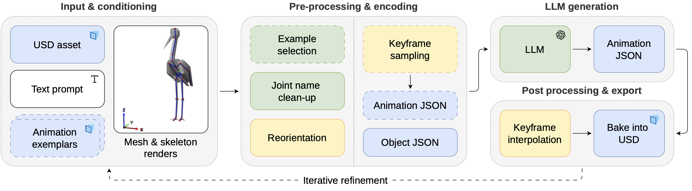

# GenRA: End-to-end Framework for LLM-Driven Animation of Rigged 3D Models

GenRA is an end-to-end framework for generating and editing 3D animations directly on user-provided assets. GenRA preserves the original rig, skinning, and geometry, employs LLM-driven joint-space motion generation, and produces production-ready animations in [OpenUSD](https://openusd.org/release/index.html) format with strong prompt adherence. To the best of our knowledge, it is the first approach of this kind to enable iterative refinement.

This repository is being published as the source code accompanying research of *GenRA: End-to-end Framework for LLM-Driven Animation of Rigged 3D Models*.

## Pipeline



At a high level, the pipeline is:

1. Read the base USD model and the example animations, and extract skeleton metadata, bind pose, animation transformations and other metadata.
2. Convert the rig into a compact Object JSON representation, and sample or decimate dense input animations into sparse key moments that can be used as few-shot Animation JSON examples. Optionally, for the use cases when multiple animations for the single model is available, the pipeline provides the best example selection for the better quality of the result. 
3. Build the LLM prompt from the model description, request text, rig and animation representaitons, optionally augmenting the prompt with multi-view rig-overlay renders of the input model.
4. Send the assembled prompt through the provider adapter in `src/anim_gen/generation/api.py` into the LLM, which generates the sparce animation keyframes, in the form of animation JSON.
5. Interpolate the generated keyframes back into dense animation curves and write the result back to USD. Optional Blender-based preview rendering can also be enabled.


## Setup

The project targets Python 3.10+.

```bash
python -m venv .venv
source .venv/bin/activate
pip install --upgrade pip
pip install -r requirements.txt
export PYTHONPATH="$(pwd)/src"
```

### Main dependencies

The runtime dependencies are listed in `requirements.txt`, with the most important being:

- `openai`
- `usd-core`
- `numpy`
- `Pillow`
- `numba`

Blender is optional, but required for `render_rig=True` or `render_video=True`.


## Configuration

### API provider configuration

The current implementation in `src/anim_gen/generation/api.py` is wired to the OpenAI Responses API, and the same provider is also used for example selection, motion-description cleanup, and related helper stages.

That provider-specific logic is localized and can be adapted to other providers or custom models by modifying the request/response handling in `api.py` and the small helper modules that call the same API pattern.

For the current implementation, set your key in the environment:

```bash
export OPENAI_API_KEY="your-key-here"
```

### Blender configuration

If Blender is on your `PATH`, no extra configuration is needed. Otherwise:

```bash
export BLENDER_BIN="/absolute/path/to/blender"
```

### Library configuration

There are two levels of configuration:

- `Config`: per-run options such as `model`, `interpolation_type`, `temperature`, `top_p`, and `reasoning_effort`
- `SystemConfig`: global defaults such as default models, retry count, interpolation defaults, rig-render settings, and other more low-level detail configurations.

Most users only need `Config`.

## Quickstart

This repository is intended to be run from a local source checkout. After installing `requirements.txt`, either:

- run your own Python entrypoint with `PYTHONPATH=src`
- run the standalone reference scripts under `examples/` and `scripts/`

For a minimal source-checkout workflow, from the repository root:

```bash
source .venv/bin/activate
export PYTHONPATH="$(pwd)/src"
python your_script.py
```

A minimal script looks like this:

```python
from anim_gen.config import GenerationMode
from anim_gen.data_structs import AnimationFile, Config
from anim_gen.generation.generation import generate_animation

base_animation = AnimationFile(
    path="examples/book.usda",
    caption={
        "model_description": "a book",
        "motion_description": "A book is opened and closed.",
    },
)

result = generate_animation(
    dest_path="outputs/result_generated.usda",
    request={"description": "A book opens slowly and remains stationary."},
    base_file=base_animation,
    animation_examples=[base_animation],
    mode=GenerationMode.GENERATE,
    config=Config(
        interpolation_type="auto",
        model="gpt-5.4",
        reasoning_effort="medium",
    ),
    logs_path="outputs/generation.log",
    metadata_path="outputs/metadata.json",
    render_rig=False,
    render_video=False,
    auto_select_examples=False,
)

print(result["filepath"])
print(result["metadata"].keys())
```

Important notes about this example:

- `base_file` describes the model being animated.
- `animation_examples` should contain one or more example animations on the same rig.
- Reusing `base_file` as an example only works when that USD already contains animation data.
- If your base/example USDs already contain the custom metadata written by this library, the library can reuse that metadata automatically.


## Refinement workflow

The same API supports refinement of an existing animation. The base animation can be:

- an animation previously generated by this library
- a third-party authored animation on the same rig, provided the USD contains animation data and you supply the caption information if it is not already embedded as custom metadata

For example:

```python
from anim_gen.config import GenerationMode
from anim_gen.data_structs import AnimationFile
from anim_gen.generation.generation import generate_animation

generated_file = AnimationFile(path="outputs/result_generated.usda")

result = generate_animation(
    dest_path="outputs/result_refined.usda",
    request={"description": "Keep the same motion, but add a subtle bounce in the end."},
    base_file=generated_file,
    mode=GenerationMode.REFINE,
)
```

In `REFINE` mode, the base USD must already contain animation. If it was not generated by this library, the code falls back to sampling keyframes from the authored animation.

## Running the reference scripts

The repository includes standalone reference scripts in `examples/`:

- `examples/generation.py`
- `examples/auto_select.py`

Before running them:

1. Create and activate a virtual environment.
2. Install `requirements.txt`.
3. Export `PYTHONPATH` so Python can import `anim_gen` from `src/`.
4. Replace the placeholder `/path/to/openai_key.txt` in the script you want to run, or edit the script to read `OPENAI_API_KEY` directly.
5. Run the script from the `examples/` directory so paths like `./book.usda` resolve correctly.

Example:

```bash
source .venv/bin/activate
export PYTHONPATH="$(pwd)/src"
cd examples
python generation.py
```

## Auto selection
`auto_select.py` demonstrates automatic example selection. In the original internal setup, it relies on a local example-assets directory under `src/anim_gen/generation/assets/`.

Expected local structure:

```text
src/anim_gen/generation/assets/
├── selection_metadata.json
├── captions/
│   ├── example_a.json
│   └── example_b.json
└── usd_files/
    ├── example_a.usdc
    └── example_b.usdc
```

The selection flow expects:

- `selection_metadata.json` to be a JSON object keyed by example name
- `captions/<example_name>.json` to exist for each example and contain at least `model_description` and `motion_description`
- `usd_files/<example_name>.usdc` to exist for each example name returned by the selector

The `rig_type` field is also consumed by the auto-selection prompt. It should be understood as an example of a scenario-specific compatibility label rather than a universal rig taxonomy. In our concrete setup, the same 3D mesh could be authored with two different rig variants, so the metadata used `rig_type` values such as `simple` and `complex` to help the selector prefer examples that were structurally compatible with the requested generation.

In practice, each entry in `selection_metadata.json` should follow the same structure used by the repository example:

```json
{
  "example_name": {
    "caption": {
      "motion_description": "A short natural-language description of the motion.",
      "semantic_tags": ["tag_a", "tag_b"],
      "contextual_hints": ["hint_a", "hint_b"]
    },
    "rig_type": "simple",
    "additional_joints": [],
    "duration": 1.25,
    "total_keyframes": 24,
    "transformation_ratios": {
      "translation": 0.4,
      "rotation": 0.5,
      "scale": 0.1
    }
  }
}
```

The example name must match across all three locations:

- the key in `selection_metadata.json`
- the filename in `captions/`
- the filename in `usd_files/`

If your own setup does not have multiple rig variants for the same mesh, you can still keep `rig_type` as a simple compatibility marker with whatever labels make sense for your data, as long as you use them consistently across the example set and selection prompt.

If you do not want to maintain this structure, the simpler workflow is to bypass auto-selection and pass `base_file` and `animation_examples` explicitly.


## Inputs and return value

### Expected inputs

For best results, provide:

- one base USD file containing the target rig
- one to three example animated USD files on the same rig
- captions with:
  - `model_description`
  - `motion_description`

The user request passed to `generate_animation(...)` must currently include:

```python
{"description": "..."}
```

The returned Python value is:

```python
{
    "filepath": "...", # path to the resulting USD file.
    "metadata": {...} # metadata containing details about the pipeline pass.
}
```

The written USD also stores custom metadata such as the generated animation JSON, motion description, model description and generation timestamp.

## Important assumptions and limitations

- Input USD files must contain exactly one `UsdSkel.Skeleton`.
- The method operates on skeletal transforms (translations, rotations, scales). It is not intended for blendshape-driven animation pipelines.
- The prompt templates and built-in example metadata in this repository are tuned to the research setup, especially the "Eney"/blob-style character and related examples. Evaluations and other results generated during research show that these same prompts works as well with other models, however, you may benefit from tuning for your specific scenarios.
- `GenerationMode.GENERATE_FT` is declared in the codebase but is not implemented yet.
- If you set `Config(model=...)`, the current implementation validates that model name through the OpenAI API.
- Automatic example selection and `AnimationFile.from_example(...)` rely on example assets. In this source checkout, the caption metadata and examples are not provided, so refer to the [`Auto selection` section](#auto-selection) for a proper setup.


## License

This project is licensed under Apache 2.0 with the Commons Clause condition. See [`LICENSE`](./LICENSE) and [`NOTICE`](./NOTICE) for details.
